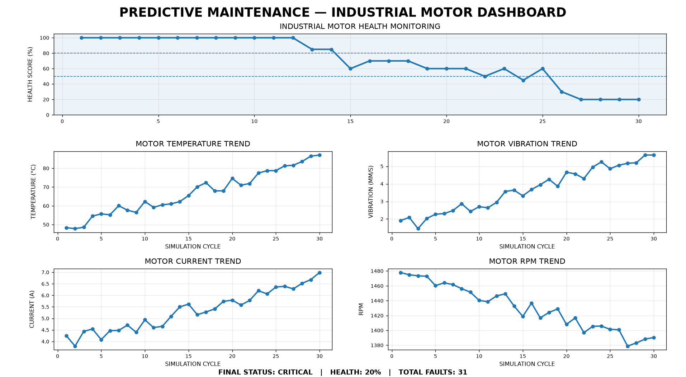

# Predictive Maintenance Simulator

A Python-based predictive maintenance simulator designed to monitor the health and operating condition of an industrial motor using simulated sensor data.

## 📌 Project Overview

Predictive maintenance helps identify abnormal machine conditions before they lead to major failures.

This project simulates an industrial motor and generates sensor parameters such as:

- Temperature
- Vibration
- Current
- RPM

The system analyzes the simulated sensor values, calculates a machine health score, detects abnormal operating conditions, classifies faults, and provides maintenance recommendations.

The project also visualizes the motor's operating condition through a dashboard.

## 🚀 Features

- Industrial motor sensor simulation
- Gradual machine degradation simulation
- Temperature monitoring
- Vibration monitoring
- Motor current monitoring
- RPM monitoring
- Machine health score calculation
- Fault detection
- Warning and critical fault classification
- Maintenance recommendations
- Fault statistics
- CSV sensor data logging
- Predictive maintenance dashboard
- Sensor trend visualization

## 🛠️ Technologies Used

- Python
- NumPy
- Pandas
- Matplotlib
- VS Code
- Git
- GitHub

## 📂 Project Structure

```text
Predictive-Maintenance-Simulator/
│
├── data/
│   └── motor_sensor_data.csv
│
├── src/
│   ├── main.py
│   ├── sensor_simulator.py
│   ├── health_monitor.py
│   └── fault_detector.py
│
├── .gitignore
├── LICENSE
└── README.md


⚙️ How the System Works
The simulator follows these main steps:
Sensor Data Simulation
        ↓
Temperature / Vibration / Current / RPM
        ↓
Machine Health Analysis
        ↓
Fault Detection
        ↓
Fault Classification
        ↓
Maintenance Recommendation
        ↓
Dashboard Visualization


📊 Sensor Parameters
Parameter	Description
Temperature	Monitors motor operating temperature
Vibration	Detects abnormal mechanical vibration
Current	Monitors motor electrical current
RPM	Monitors motor rotational speed


🧠 Predictive Maintenance Logic
The system evaluates the simulated sensor values and calculates a machine health score.
Based on the sensor conditions, the system can identify different operating states such as:
- Normal
- Warning
- Critical
When abnormal conditions are detected, the system generates a maintenance recommendation.


💻 Installation
Clone the repository:
git clone https://github.com/davanaachar-debug/Predictive-Maintenance-Simulator.git

Open the project folder:
cd Predictive-Maintenance-Simulator

Create a virtual environment:
python -m venv venv

Activate the virtual environment on Windows:
venv\Scripts\activate

Install the required Python packages:
pip install numpy pandas matplotlib


▶️ Running the Project
Run the main program using:
python src/main.py

The simulator will generate motor sensor data, analyze the machine condition, detect faults, and display the maintenance monitoring results.


📈 Output
The project provides:
- Simulated motor sensor readings
- Machine health score
- Fault status
- Maintenance recommendations
- Fault statistics
- Sensor trend graphs
- Predictive maintenance dashboard


🎯 Applications
This type of predictive maintenance system can be applied to:
- Industrial motors
- Manufacturing equipment
- Automated machinery
- Pumps
- Conveyor systems
- Electrical machines


🔮 Future Improvements
Possible future enhancements include:
- Real-time IoT sensor integration
- Arduino or ESP32 integration
- Raspberry Pi implementation
- Machine learning-based fault prediction
- Real-time dashboard using Streamlit
- Cloud-based sensor monitoring
- Email or mobile maintenance alerts
- Remaining Useful Life (RUL) prediction


👨‍💻 Author
D S Davana
Electronics & Communication Engineering


📄 License
This project is licensed under the MIT License.

## 📊 Dashboard


